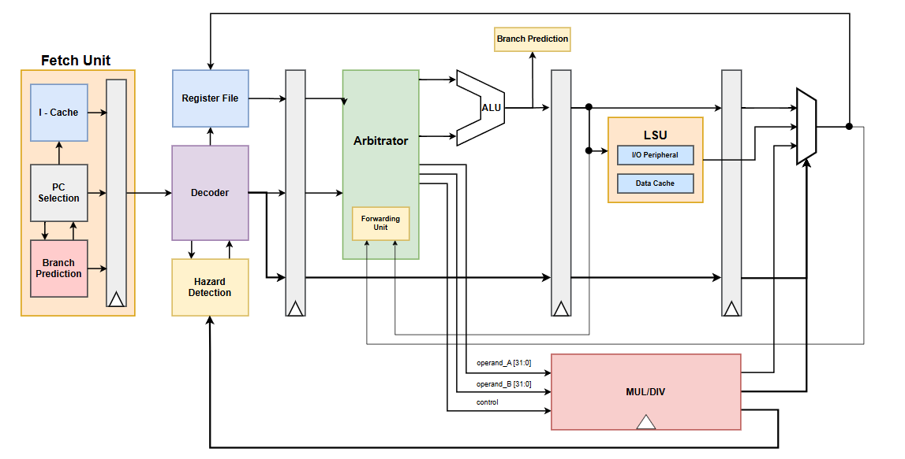

# RV32IM_core

This is a **RISC-V RV32IM processor core** currently under development by MAARS. The design is written in **SystemVerilog** and targets FPGA implementation. It is based on a classic **5-stage pipeline architecture**, and the system uses a **synchronous reset (active high)** scheme. The core supports the **RV32IM** instruction set.

## CPU Architecture Diagram

