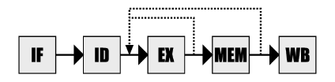
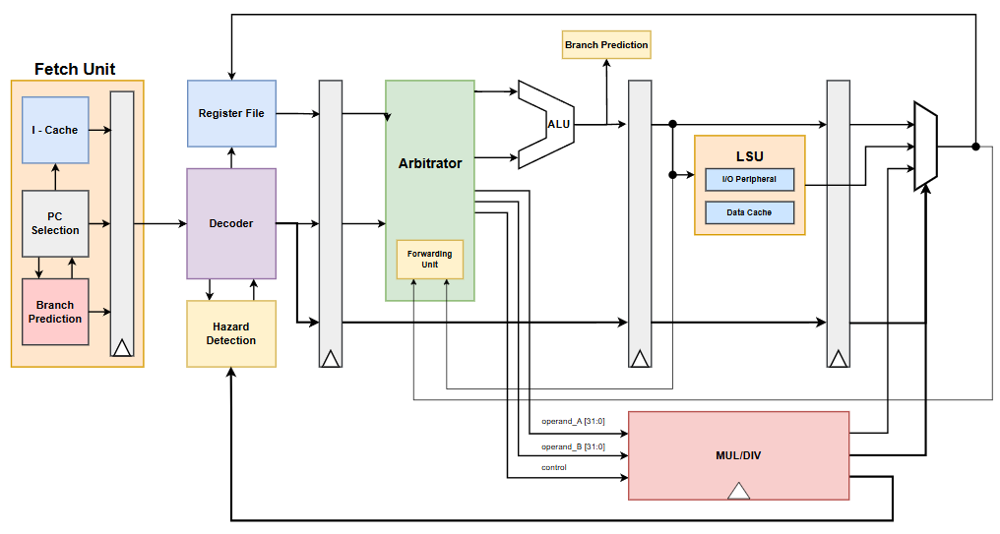
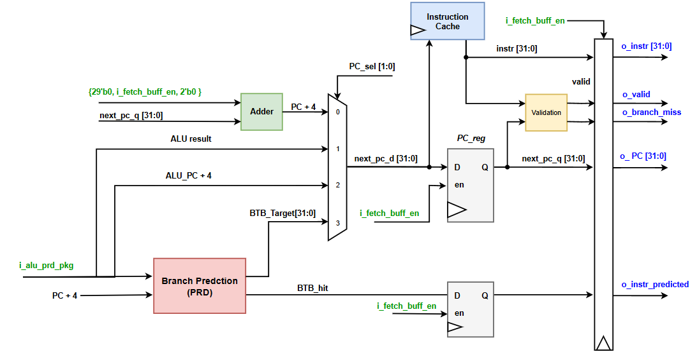

# 1. System Overview

### 1.1. Architecture Overview
This design implements a 5-stage pipelined processor based on the RISC-V RV32IM instruction set, with a strong emphasis on stability, simplicity, and efficiency in both area and power. The architecture is highly modular, making it well-suited for FPGA prototyping and future extensions. The processor pipeline consists of five main stages:

- **IF (Instruction Fetch):** Fetches the next instruction from instruction memory.
- **ID (Instruction Decode):** Decodes the instruction and reads operands from the register file.
- **EX (Execute):** Performs arithmetic/logic operations and address calculations.
- **MEM (Memory Access):** Accesses data memory for load/store instructions.
-  **WB (Write Back):** Writes computation or memory results back to the register file.

  

Each stage consists of separate hardware modules, communicating via stage buffers that preserve control and data signals.

  

The Fetch stage is encapsulated entirely within a dedicated Fetch Unit, which includes branch prediction logic, a program counter selector and register, and a small instruction cache. It outputs to a stage buffer that separates it from the Decode stage, enhancing modularity and simplifying future upgrades. 

### 1.2. Stage Overview

The Fetch stage is encapsulated entirely within a dedicated Fetch Unit, which includes branch prediction logic, a program counter selector and register, and a small instruction cache. It outputs to a stage buffer that separates it from the Decode stage, enhancing modularity and simplifying future upgrades. 

In the Execute stage, the Arbitrator plays a central role in operand selection and functional unit management. It routes instructions to available execution units such as the ALU and is designed with future support for modules like the FPU, multiplier, or divider. Integrated within the Arbitrator is a Forwarding Unit, responsible for handling data hazards by forwarding results to dependent instructions without pipeline stalls when possible. 

The processor also implements a hazard detection unit to manage cases that cannot be resolved by forwarding alone, introducing stalls only when necessary to preserve correctness. This approach ensures the pipeline remains efficient and responsive under typical workloads. 

The Memory stage is managed by a Load/Store Unit (LSU), which handles memory accesses and provides a basic memory-mapped I/O interface. In this simplified version, the LSU includes a small local data memory and a few I/O control registers. Future versions can be extended to include full support for external bus protocols and more complex peripheral communication.

I/O interfacing is handled entirely through the LSU and memory-mapped registers. The processor exposes two 32-bit input ports (for switches and general input) and four 32-bit output ports (labeled A through D), enabling flexible integration with testbenches, peripherals, and embedded applications.

# 2. Microarchitecture and Design Note

## 2.1 Fetch Stage
### 2.1.1. Microarchitecture
The Fetch Unit manages all tasks in the fetch stage, including branch prediction, selecting the next program counter (PC), and reading instructions from the instruction cache. It decides the next PC based on pipeline status and prediction results to fetch the correct instruction each cycle.

  

The Fetch stage required at least 2 cycles to fetch new instruction, the first cycle is used to select the next PC address to request data from Instruction Cache and next cycle is used to fetch the instruction. For this reason, most processor seperate the instruction fetching operation in to 2 stages, 1 stage is used to select the PC, this stage also important in pipeline balancing since accessing BTB from branch prediction already introduce a large delay, the second stage is used to fetch instruction from cache since the most memory cache required handshake and synchronous fetch operation.

Therefore, in this microarchitecture the selected next PC is registed in a PC register while fetch instruction from Memory, the PC register also important when we need to hold the PC value while resolve Cache miss or waiting for Instruction Memory to respond.

The PC register and stage buffer both use input enable signals to support stalling when needed. 

### 2.1.2 PC Selection

The PC multiplexer supports four PC sources, selected using the PC_sel signal. These sources are listed in the following table:

| **PC_sel**   *(2-bit)* | **Selected Data**   *(32-bit)* | 
**Description**
                                                                  |
| :-----------------------: | :-------------------------------: | ---------------------------------------------------------------------------------------------------------- |
|           2’b00           |             pc_plus4              | Default PC increment: used when no branching occurs                                                        |
|           2’b01           |         alu_update_target         | Target address from ALU,  used to correct “not taken” branch mispredictions.                            |
|           2’b10           |           alu_pc_plus4            | PC + 4 from branch instruction in EX stage,  used to restore PC when a “taken” branch was mispredicted. |
|           2’b11           |           prd_br_target           | Predicted branch target from PRD  (BTB hit and branch predicted as taken).                              |

> [!warning] Initialization
> After reset signal is triggered, the PC register is clear to value zero

## 2.2 Decode Stage

In the **Decode stage**, the main components are the instruction decoder, the register file, the forwarding unit, and the hazard detection unit. 

These modules mainly rely on information coming directly from the fetched instruction, such as the source and destination register addresses. Since they operate in parallel and are not heavily dependent on one another, their placement together in this stage does not create significant additional delay.

>[!info] Forwarding Unit and Register File
The **forwarding unit** is placed in the Decode stage alongside the register file to ensure correctness during both normal execution and stalls. Its role is to forward results from later pipeline stages back to earlier ones when needed. However, if a stall occurs, the forwarding unit’s stage is also stalled, while results in later stages may continue to move forward and even be written back into the register file. By locating the forwarding unit in the same stage as the register file, the forwarded values always remain consistent with the register file contents. If the forwarding unit were separated from the register file, it would risk forwarding incorrect values to the source registers during such conditions.

